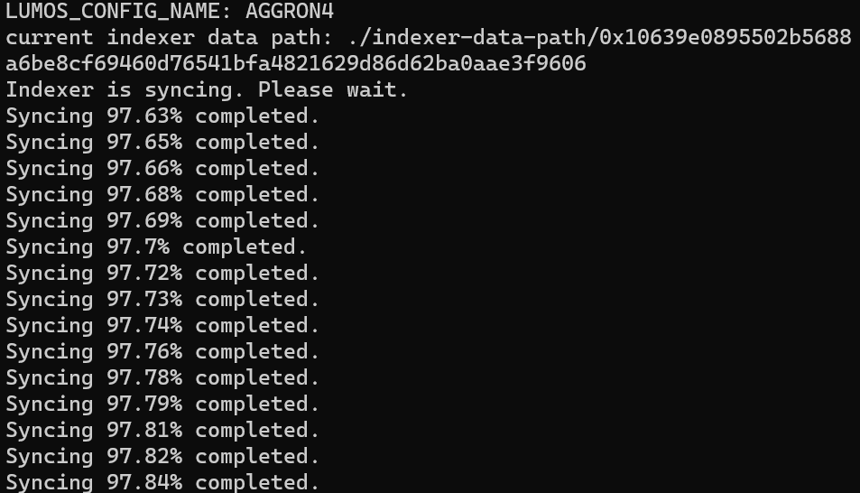
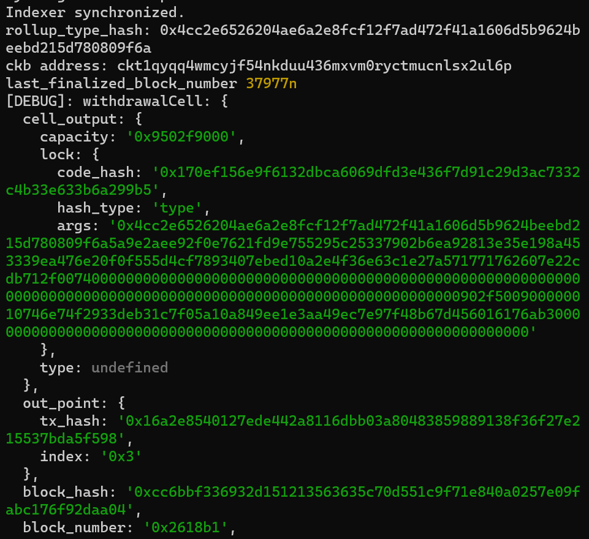

# Gitcoin: 10) Complete Withdrawal Process By Unlocking The Funds

## 1. A screenshot of the console output immediately after running the "unlock" command.

2. The Ethereum address that you've used for your Layer 2 account (in text format).
0x4878d26222E999071E439fA5034883467B416fbc

3. The Nervos Layer 1 address that you passed to withdraw command (in text format).
ckt1qyqq4wmcyjf54nkduu436mxvm0ryctmucnlsx2ul6p