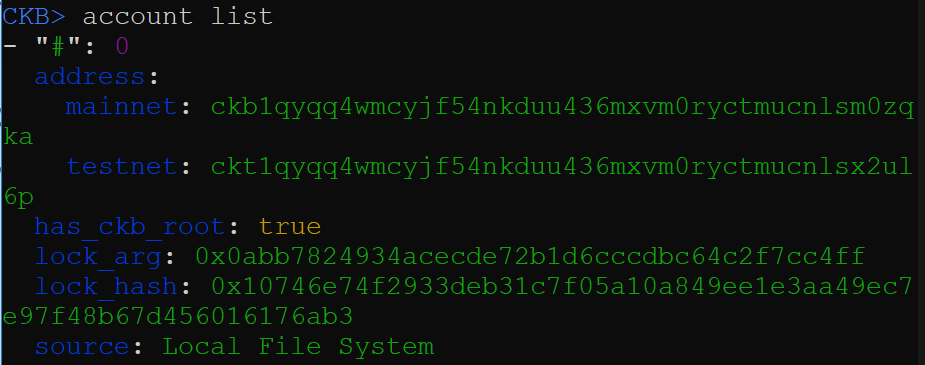
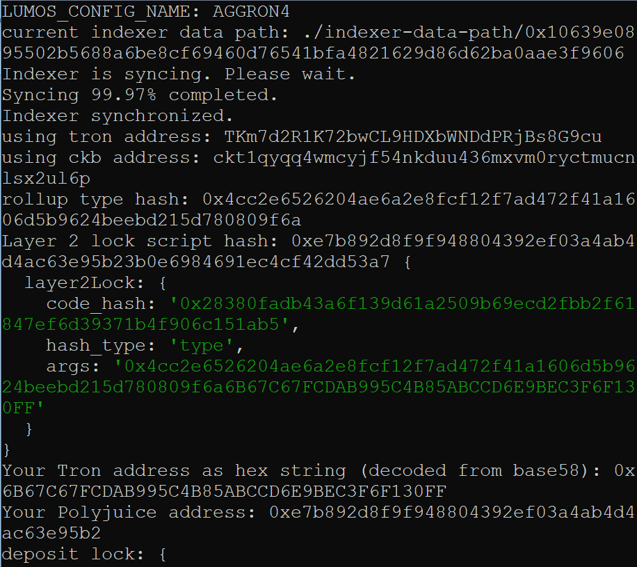
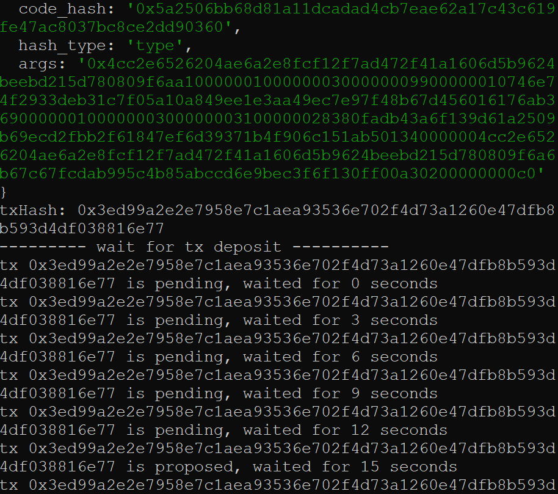
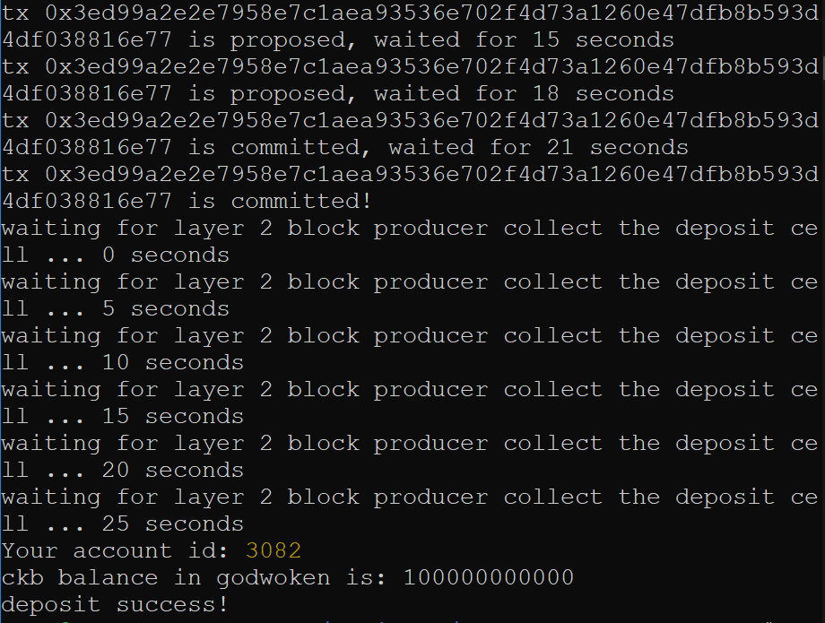
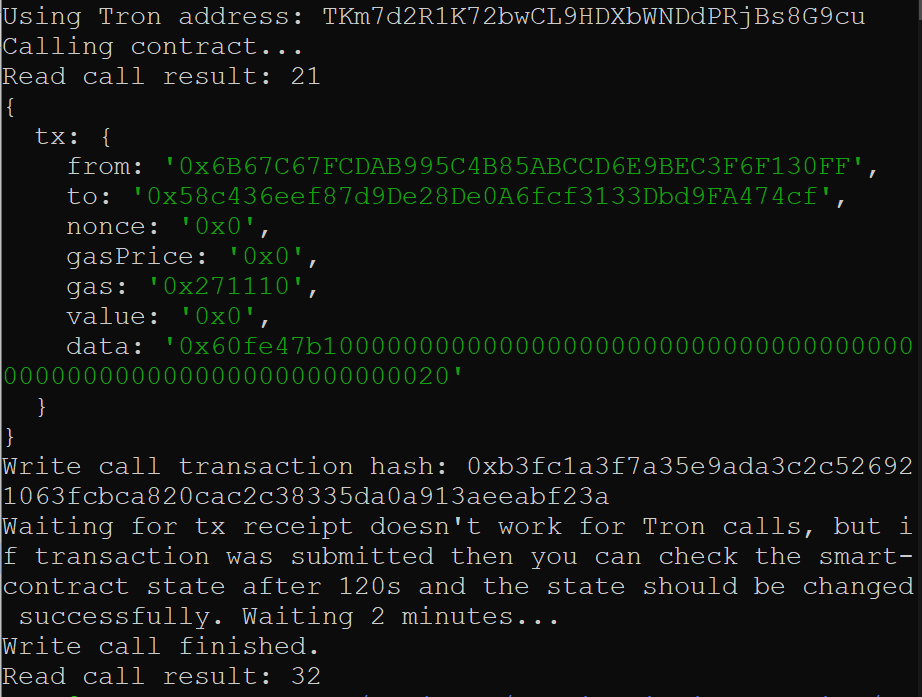

### Screenshot of accounts in ckb-cli



### Layer 1 address on the Testnet Explorer
https://explorer.nervos.org/aggron/address/ckt1qyqxg8k5p0zzgtvadrcg673nyc3uljsc3dksv6wj2n

### Screenshot of deposit to L2 Tron Account



### Screenshot of smart contract calls



### Contract call transaction hash
0xb3fc1a3f7a35e9ada3c2c526921063fcbca820cac2c38335da0a913aeeabf23a

### Contract address
0x58c436eef87d9De28De0A6fcf3133Dbd9FA474cf

### Contract ABI
```json
[
  {
    "inputs": [],
    "stateMutability": "payable",
    "type": "constructor"
  },
  {
    "inputs": [
      {
        "internalType": "uint256",
        "name": "x",
        "type": "uint256"
      }
    ],
    "name": "set",
    "outputs": [],
    "stateMutability": "payable",
    "type": "function"
  },
  {
    "inputs": [],
    "name": "get",
    "outputs": [
      {
        "internalType": "uint256",
        "name": "",
        "type": "uint256"
      }
    ],
    "stateMutability": "view",
    "type": "function"
  }
];
```

### Tron Address
TMpCLvS2BP7nHWeNqDqCiQR2LVJyYuWkKH