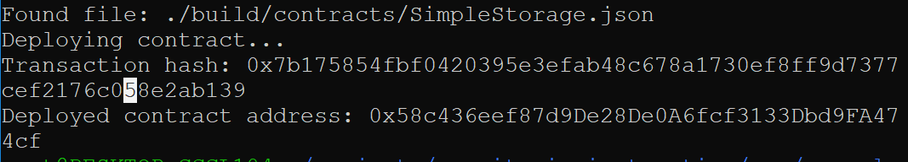

# 2. Deploy a Simple Ethereum Smart Contract on Polyjuice</h2>

## 1. A screenshot of the console output immediately after you have successfully deployed a smart contract.

## 2. The transaction hash from the contract deployment (in text format).

  <b>0x7b175854fbf0420395e3efab48c678a1730ef8ff9d7377cef2176c058e2ab139</b>      
   
## 3. The deployed contract address from the contract deployment (in text format).

<b>0x58c436eef87d9De28De0A6fcf3133Dbd9FA474cf</b>
