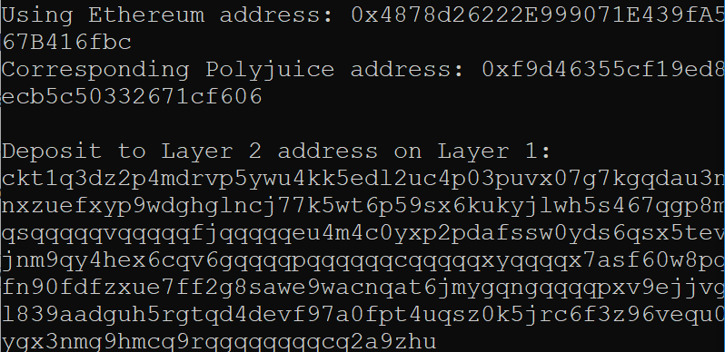

# Gitcoin: 6) Use Force Bridge to Deposit Tokens From Ethereum to Polyjuice

## 1. A screenshot of the console output immediately after you have successfully generated your Deposit Receiver Address.

## 2. Your Deposit Receiver Address (in text format).

  <b>ckt1q3dz2p4mdrvp5ywu4kk5edl2uc4p03puvx07g7kgqdau3n3dmypkqnxzuefxyp9wdghglncj77k5wt6p59sx6kukyjlwh5s467qgp8m25yqqqqqsqqqqqvqqqqqfjqqqqqeu4m4c0yxp2pdafssw0yds6qsx5tevcg7wsvpjnm9qy4hex6cqv6gqqqqpqqqqqqcqqqqqxyqqqqx7asf60w8pqpte2sfcfn90fdfzxue7ff2g8sawe9wacnqat6jmygqngqqqqpxv9ejjvgz2u63w3l839aadguh5rgtqd4devf97a0fpt4uqsz0k5jrc6f3z96vequ0y88a9qdygx3nmg9hmcq9rqgqqqqqqcq2a9zhu</b>   

## 3. The Ethereum address used to generate the Deposit Receiver Address (in text format).

  <b>0x4878d26222E999071E439fA5034883467B416fbc</b>   

## 4. A link to the Etherscan explorer for the successful Force Bridge transaction. This can be found on Force Bridge under History→Succeed.

https://rinkeby.etherscan.io/tx/0xb1a9aa02f8dcc9f1e2c672d6cb6fdc8c517799c6475454bacc2741934906a2a6

## 5 A link to the Nervos explorer for the successful Force bridge transaction. This can be found on Force Bridge under History→Succeed.

https://explorer.nervos.org/aggron/transaction/0x7aa3f7a384f9659e1d63b4f1b356e512e7c52a709acebbcefa2a506b055caf4d
