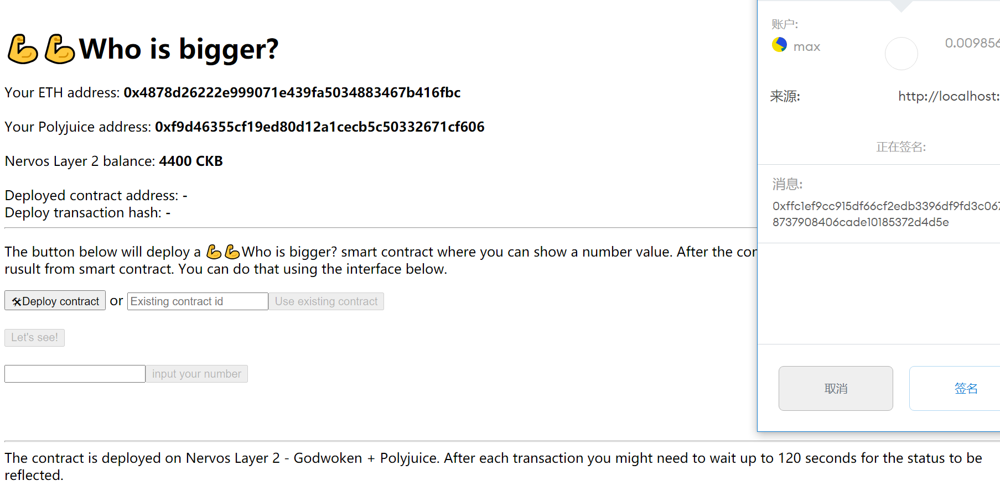
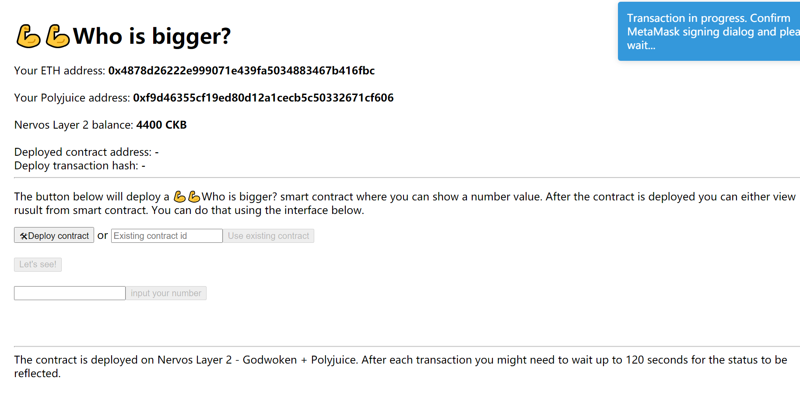
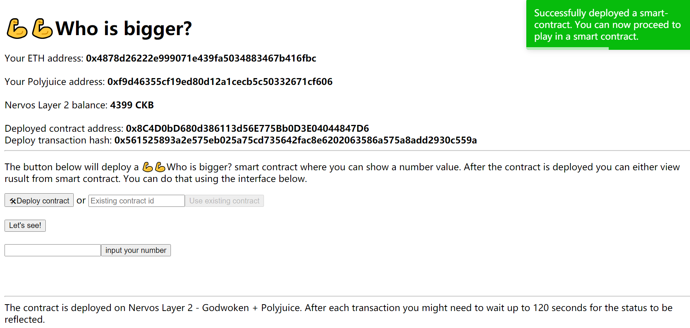
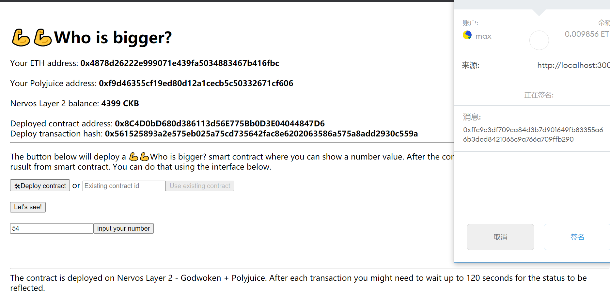
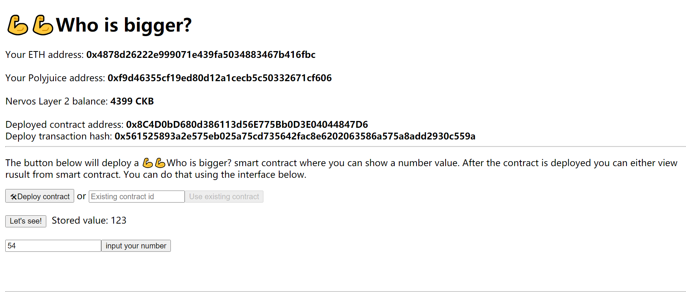

# Gitcoin: 7) Use Force Bridge to Deposit Tokens From Ethereum to Polyjuice

## 1. Screenshots or video of your application running on Godwoken.








## 2. Link to the GitHub repository with your application which has been ported to Godwoken. This must be a different application than the one covered in this guide.

https://github.com/1m1axx/nervos_network/tree/main/task7/WhoIsBigger
   

## 3. If you deployed any smart contracts as part of this tutorial, please provide the transaction hash of the deployment transaction, the deployed contract address, and the ABI of the deployed smart contract. (Provide all in text format.)

<b>Deployed contract address: 0x8C4D0bD680d386113d56E775Bb0D3E04044847D6
<br>Deploy transaction hash: 0x561525893a2e575eb025a75cd735642fac8e6202063586a575a8add2930c559a

</b> <br><br>

```
"abi": [
    {
      "inputs": [],
      "stateMutability": "payable",
      "type": "constructor"
    },
    {
      "inputs": [
        {
          "internalType": "uint256",
          "name": "x",
          "type": "uint256"
        }
      ],
      "name": "set",
      "outputs": [],
      "stateMutability": "payable",
      "type": "function"
    },
    {
      "inputs": [],
      "name": "get",
      "outputs": [
        {
          "internalType": "uint256",
          "name": "",
          "type": "uint256"
        }
      ],
      "stateMutability": "view",
      "type": "function"
    }
  ],


```
