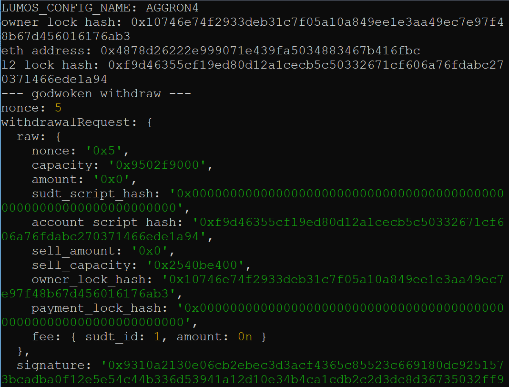

# Gitcoin: 9) Use Force Bridge to Deposit Tokens From Ethereum to Polyjuice

## 1. A screenshot of the console output immediately after running the withdraw command.

## 2. The Ethereum address that you've used for your Layer 2 account (in text format).

   <b>0x4878d26222E999071E439fA5034883467B416fbc</b>   

## 3. The Nervos Layer 1 address that you passed to withdraw command (in text format).

  <b>ckt1qyqq4wmcyjf54nkduu436mxvm0ryctmucnlsx2ul6p</b>   
